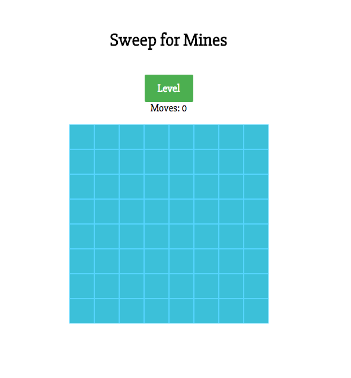

# Minesweeper

[Github live]: https://lee-cjanet.github.io/Minesweeper/

This game is a recreation of Minesweeper using vanilla Javascipt only.

## Features

  * Player can chose game level

  * Game counts number of moves per game

  * Board is immobile once a mine is triggered or game is won

----

______
## Future Directions
  * Add Timer

  * Player can chose different map shapes

___

See the development [README][readme] for a list of components, wireframes, sample state, and DB schema.

[readme]: docs/README.md
